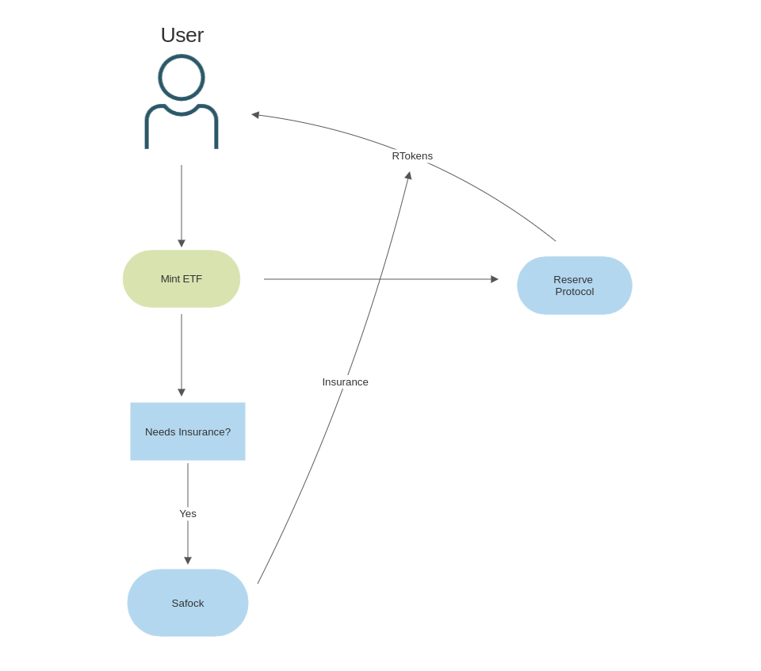
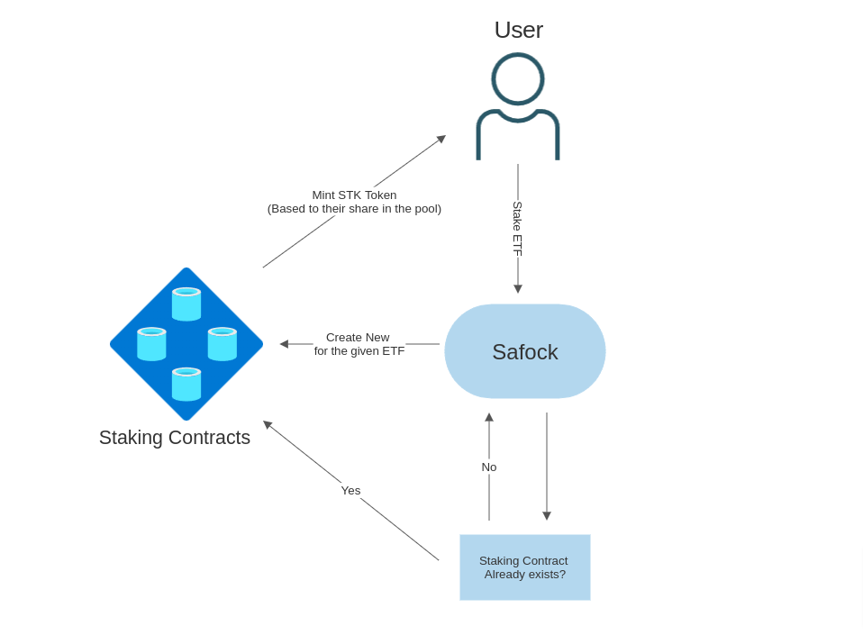

## SAFOCK - Opening Doors to DeFi ETFs

Safock is a DeFi platform that focuses on crypto (ETFs) trading in a decentralized way, Backed by RTokens. 
(This project is a submission to the Reserve Protocol Hackathon💎)

 

  <a href="https://safock.com">Safock.com</a>
  <h6>Backed by RTokens</h6>

 
 

## Overview

Safock is a Crypto ETF platform that opens doors to purchase Defi crypto ETFs. Safock makes it easy to bundle together various yield-generating collateral assets to create a customized financial product while utilizing an insurance backstop and fully on-chain transparency to protect users. This functionality is perfect for creating crypto ETF, as the deployer can choose their custom basket of underlying assets, and even use yield-generating assets to generate revenue. And users can stake their ETF too with our platform for even higher yields.

ETFs are investment vehicles that track the performance of a particular asset or basket of assets, and they are traded on exchanges like stocks but as they're backed by centralized commodities the barrier of entry is too high that's why we build Decentralized Finance ETFs, also known as "DeFi ETFs" are ETFs(exchange-traded funds) that are built on blockchain technology and backed by Rtokens. This allows for a more transparent and secure way to invest in a diversified portfolio of crypto assets.

One of the key features of Safock is it's focus on providing investors with a wide range of DeFi ETFs to choose from. These ETFs are designed to insure and stake various crypto assets, such as Bitcoin, Ethereum, and other popular cryptocurrencies, as well you can also deploy and mint an ETF of revenue-generating tokens like aETH, aDai, etc. This allows investors to easily diversify their portfolio and gain exposure to the performance of the overall crypto market. In addition to providing access to a wide range of DeFi ETFs, Safock also offers other useful features. For example, it provides insurance for volatile assets, staking to gain yield rewards and many more. It also offers a user-friendly interface making it easy for investors of all experience levels to mint and redeem DeFi ETFs.

## Benefits of DeFi ETFs

A decentralized finance exchange traded funds, also known as a DeFi ETFs is a type of trading of multiple digital currencies aka cryptocurrencies in one basket or many crypto assets pools. Some potential benefits of using DeFi ETFs include: 

• High liquidity: Because DeFi ETFs are traded on dapps (and might start trading on DEXs soon), they can be bought and sold easily, providing investors with greater liquidity than they would have if they held the underlying cryptocurrencies directly. 

• Diversification: DeFi ETFs allow investors to diversify their cryptocurrency holdings without having to purchase and manage multiple different cryptocurrencies. 

• Transparency: DeFi ETFs provide investors with greater transparency into the underlying assets because the holdings of the fund are published on the blockchain. 

• Accessibility: DeFi ETFs make it easier for investors to access the cryptocurrency market, as they can be purchased through a wallet in the same way as other products on Dexs. 

• Own your Asset: ETFs are typically managed by professional fund managers who use their expertise to make investment decisions on behalf of investors. but in DeFi ETFs "you own your asset" in just a single DeFi wallet This can help to reduce the risks associated with investing in DeFi ETFs. 

• Reduced fees: Because DeFi ETFs are decentralized and run on the blockchain, they can potentially have lower fees than traditional ETFs that are managed by financial institutions. 

• Improved security: DeFi ETFs are built on the blockchain, which makes them more secure and resistant to hacking. This can help to protect investors from potential losses. 

• Greater flexibility: DeFi ETFs can be customized and tailored to meet the specific needs and preferences of investors, providing greater flexibility than traditional ETFs. 

• Potentially higher returns: DeFi ETFs can offer investors the potential for higher returns than traditional ETFs because they track the performance of cryptocurrencies, which have the potential to generate significant gains. 

DeFi ETFs offer investors a number of potential benefits, including but not limited to high liquidity, diversification, transparency, accessibility, own your asset, reduced fees, improved security, greater flexibility, and potentially higher returns.

## How it Works

(Note: We're currently on goerli testnet, mainnet will launch soon).

For creating and minting ETFs, Safock uses Reserve Protocol as the Reserve Protocol makes it easy to bundle together various yield generating collateral assets to create a customized financial product.

All the logic minting and redeeming of ETFs is handled by Reserve Protocol. But we add an extra layer in frontend to make it easy to mint RTokens and simplifies the overall process for users.

### Insurance: 

To save our users from losses, we also provide insurance to our customers.

There are currently 4 insurance plans that we provide. The insurance can be claimed if it meets the conditions.

1. BASIC -> cost = 1% of price, lose cover upto 30%. **Conditions:** If the price drops atleast 20% then the purchased price. Validity 3 month.
1. PRO -> cost = 3% of price, lose cover upto 50%. **Conditions:** If the price drops atleast 20% then the purchased price. Validity 3 month.
1. PRO_PLUS -> cost = 5% of price, lose cover upto 70%. **Conditions:** If the price drops atleast 20% then the purchased price. Validity 3 month.
1. PRO_MAX -> cost = 7% of price, lose cover upto 100%. **Conditions:** If the price drops atleast 20% then the purchased price. Validity 3 month.

(Although we can change them after looking at stats and data when we deploy that on mainnet.)

 

### Dynamic staking: 

As a core feature of our product we also provide ETF (RToken) staking. We're implementing dynamic staking here. For most common staking applications, the admin has to provide the estimated APY for the program for a certain period of time beforehand. With the dynamic staking approach, it calculates the APY dynamically for a particular stakeholder based on the number of stakeholders, their staked amount, and the rewards which were added to the Staking contract address till that point in time. There is no lock-in time for the stakeholder's stake in this approach. Stakeholders can remove their stake at any point in time and can claim the rewards. We are providing STK Token in exchange of their RTokens. 

The financial logic of the staking smart contract is to mint STK Token to each stakeholder and rewards are in proportion to the STK Token. Just like Mutual Funds derive the NAV(Net Asset Value) and it increases or decreases based on the STK Token and their asset value inside of it, the similar way the NAV, in this case, will be RToken per STK Token price which will increase as and when rewards are added to the staking program. 

By default the initial ratio will be set at 1:1, so 1 RToken is equal to 1 STK Token. Each user who stakes at this ratio will receive an equal amount of STK Token for the number of RToken she/he staked. During the month a reward will be sent to the Staking smart contract, which will alter the number of RToken on the contract and by default alter the RToken per STK Token ratio. 

#### Example flow -

1. Initially the RToken/STK Token ratio will be 1.
2. `StakeholderA` stakes 1000 RToken token at this point, so `StakeholderA` will receive 1000 STK Token.
3. Reward of 100 RToken is deposited on the Staking contract address.
4. Now, the RToken/STK Token ratio gets increase to 1.1 (total RToken / number of STK Token = 1100/1000)
5. `StakeholderB` stakes 1000 RToken token at this point, so `StakeholderB` will receive 1000/1.1 ~ 909 STK Token
6. `StakeholderA` remove stake of 1000 RToken at this point, so `StakeholderA` will receive 1000\*1.1 = 1100 RToken. So, reward of `StakeholderA` is 1100-1000 = 100 RToken

 

## Official Links

Official Website: https://safock.com 
Documentation: https://safock.gitbook.io/docs 
Launch Dapp: https://app.safock.com 
Twitter: https://twitter.com/SafockOfficial 
Discord: https://discord.gg/KkckfSdA8R 
Medium: https://medium.com/@Safock 
Youtube: https://www.youtube.com/@Safock 
Mail: hi@safock.com  

## Mission

To build the world’s largest decentralized finance ETFs trading platform and to provide financial freedom to all people worldwide.

## Vision

To become the top DeFi ETFs trading platform with the highest number of users and planning to redefine the revolution of DeFi like never before.

## Conclusion

Overall, Safock is a promising platform for investors looking to gain exposure to the growing world of decentralized finance and crypto assets. Its focus on DeFi ETFs trading and its user-friendly design makes it an attractive option for investors looking to diversify their crypto portfolios and capitalize on the potential of the crypto market, thanks to reserve protocol that we're backed by RTokens.
